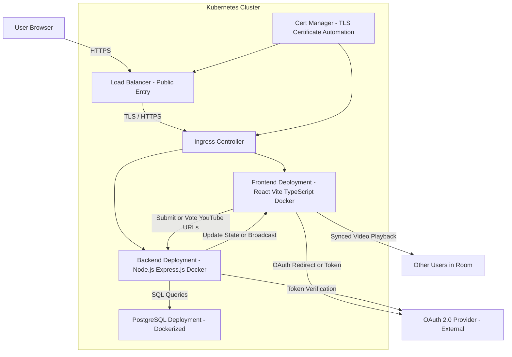

# Project Proposal Template

**Course**: Design of Dynamic Web Systems (M7011E)  
**Team Members**: Viggo Härdelin, Olle Göransson, Rasmus Kebert
**Date**: Friday, 7 November 2025

---

## 1. Problem Statement & Solution

**Problem**: Some friends cannot decide on what to watch, so they enter this magical site which lets everyone enter a youtube url and then let them vote on what to watch. 

**Solution**: Then the wheel of decisions decide sudo randomly based on what voting weight and then automatically goes to that video.

**Why Dynamic?**: Friends spend unnessacery amounts of time arguing (especially on discord) on what to watch, our platform makes that decision for them with their opinion in mind. 

*Example: Students waste time coordinating study sessions through scattered messages. Our platform provides real-time study group matching that adapts recommendations based on user availability, course enrollment, and collaboration history.*

## 2. Core Features

**Main Features** (4-5 key capabilities):
1. **[Private-rooms]**: Users should be able to create and invite to private rooms
2. **[Weighted-Voting]**: The pie size n the wheel will be decided from the amount of votes each video gets
3. **[Watch-togheter]**: Users should be able to watch a youtube video synchronized
4. **[Recomendation/Save-history]**: Recommended videos could be recommended depending in previous videos watched by a user

## 3. Target Users

**Primary Users**: People who have friends that want to watch youtube videos together (gamers)

**Key User Journey**: User enters website and clicks on "create private room", invites friends. When all friends are in room, they can send youtube-urls and vote on them. Lastly the wheel of fortunes will decide based on voting weights and the video selected will be played for everyone in the room. 

## 4. Technology Stack

**Backend**: [Node.js] with [Express.js] - *Justification: [We have chosen Express.js mainly because of one big reason, this is not a big project on enterprise-level with high demand on maintainability and scalability. Other reasons include the fact that it has an easy learning-curve for beginners (none of us has had any big interaction with node.js frameworks before). All in all, it's lightweight and easy to to use.]*
**Database**: [PostgreSQL] - *Justification: [PostgreSQL was chosen also mainly because of one big reason, it's versatility. It can be used in so many different ways that is sort of an obvious choice. It has strong consistency and gives us good relational data handling, which means it's very reliable. It will work well with our project data since we need users (maybe even some sort of friends functionality) and "events" (watch-parties). PostgreSQL is so flexible that it's, like I said, an obvious choice]*
**Frontend**: [React/Vite/typescript] *[Frontend is re-used from D0018E course, live-updates when saving new code in IDE]*
**Documentation**: [Swagger] *[We will use Swagger for our API docs, here's why: It has auto-generated and interactive documentation, it has a widely accepted OpenAPI specification, it is the go-to-choice for Node.js with Express.js.]*

## 5. System Architecture

**Architecture Overview**:

**Microservices Plan**:
- **User Service**: Handles user registration and login
- **Room Service**: Create, join, make links and handle rooms
- **Voting Service**: Counts votes for every video in a room
- **Watch Service**: Create a simultaneously youtube watching session
- **Wheel Service**: Handles vote weight and spin of the wheel

**Core Requirements**: All REQ1-REQ39 will be implemented through:
- Full stack implementation through technology stack mentioned above
- Dynamic content via room list, voting result, wheel spin, watch party
- Microservices architecture mentioned above
- Testing strategy achieving 50%+ coverage
- Cloud native with Kubernetes deployment with monitoring and docker containerization.
-  API Design & Communication with the help of RESTful API:s
-  System Design & Architecture with github repository
-  Security & Ethics with Https for communications and autentication using OAuth 2.0

**Advanced Feature**: **Option E** - Since we want to have a watch party where every member watches it synchronized. We think that "Live Data Synchronization" is a valid option.

**Target Grade**: [3/4] - If we succeed with synchronized watch together we feel like "Live Data Synchronization" is fulfilled

## 7. Development Plan
Example of development timeline:
**Weeks 1-2**: Database schema, basic services, authentication, Kubernetes setup, Docker containerization, 
**Weeks 3-4**: Core features, API implementation, CI/CD pipeline
**Weeks 5-6**: Advanced feature, comprehensive testing, security
**Weeks 7-8**: Documentation, performance analysis, final polish

## 8. Risk Assessment
**Main Risks**:
- **Technical**: Synchronized watching is something that none of us have worked with prevoisuly whitch makes it very hard for us to estimate how long it will take to implement it. Our mitigation for this is that we will start to start to read documentation of this early in the project whitch might make it easier to understand when we implement it down the line. 
- **Scope**: The biggest scope risk is will be keeping true synchronisation for all viewers. Say user 1 pauses the current video that a group watches, then there will be a short delay before it pauses for everyone else, if the paus is say 200ms then there it will create a 200ms ofsync between them. If the video buffers alot for some or if the video is paused a lot this sync delay can build up to become very annoying. Fixing this issue will most likly be a big issue.

**Fallback Plan**: We will implement everything mentioned above with the exception of watch together feature.
## 9. Team Organization

**Rasmus Kebert**: Testing, database
**Viggo Härdelin**: backend, autentication, security
**Olle Göransson**: API, backend

---

**Approval Request**: We request approval to proceed with this project concept and technology stack.
