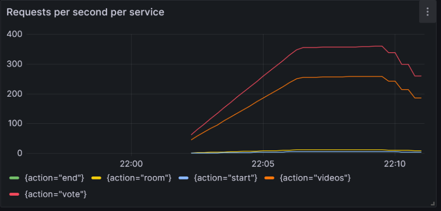

We have done several tests with the help of load testing on both system. They have their weaknesses and strength. 

In the beginning it was alot easier to build a monolith system. Since everything is on the same pod and docker image, we can easily have connection between each service with the help of express own routing system. Switching to a micro-services system was new to us since we haven't worked like that before. The connection between the micro-services was done by kubernetess own clusterIP.

Some strength with the monolith system was the simplicity with one system. It was also only one command to scale the whole system. From our tests the monolith system had more requests per service than the micro-service system.

