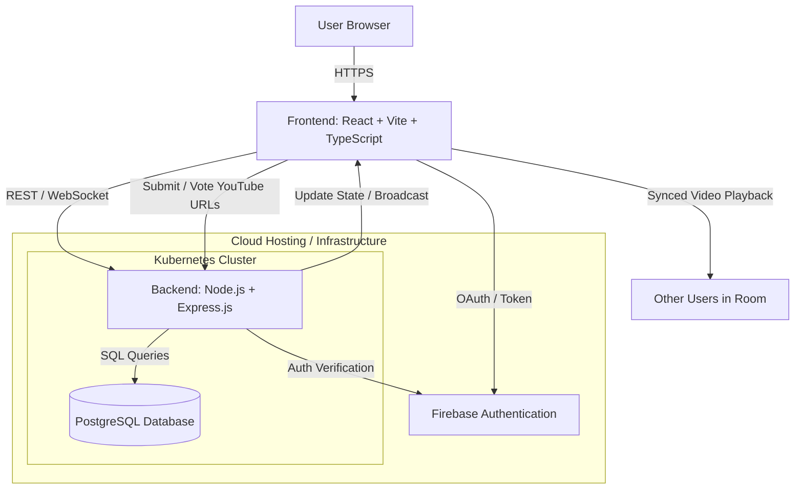

# Project Proposal Template

**Course**: Design of Dynamic Web Systems (M7011E)  
**Team Members**: Viggo Härdelin, Olle Göransson, Rasmus Kebert
**Date**: [Submission Date]  

---

## 1. Problem Statement & Solution

**Problem**: Some friends cannot decide on what to watch, so they enter this magical site which lets everyone enter a youtube url and then let them vote on what to watch. 

**Solution**: Then the wheel of decisions decide sudo randomly based on what voting weight and then automatically goes to that video.

**Why Dynamic?**: Friends spend unnessacery amounts of time arguing (especially on discord) on what to watch, our platform makes that decision for them with their opinion in mind. 

*Example: Students waste time coordinating study sessions through scattered messages. Our platform provides real-time study group matching that adapts recommendations based on user availability, course enrollment, and collaboration history.*

## 2. Core Features

**Main Features** (4-5 key capabilities):
1. **[Private-rooms]**: [Brief description]
2. **[Weighted-Voting]**: [Brief description]
3. **[Watch-togheter]**: [Brief description]
4. **[Recomendation/Save-history]**: [Brief description]

## 3. Target Users

**Primary Users**: People who have friends that want to watch youtube videos together (gamers)

**Key User Journey**: Frist user enters website and clicks on "create private room", here the user can click on the invite others button and send it to their friends. When everyone is in the room they can start to send in youtube-url and vote on what to watch. Then there is a wheel that spins and decides what to show based on the weights of the votes. When the video is decided it start to play in the room for everyone that is in there. 

## 4. Technology Stack

**Backend**: [Node.js] with [Express.js] - *Justification: [Why?]*
**Database**: [PostgreSQL] - *Justification: [Why for your data?]*
**Frontend**: [React/Vite/typescript] *(minimal implementation)*

## 5. System Architecture

**Architecture Overview**:

**Microservices Plan**:
- **User Service**: Handles user registration and login
- **Room Service**: Create, join, make links and handle rooms
- **Voting Service**: Counts votes for every video in a room
- **Watch Service**: Create a simultaneously youtube watching session
- **Wheel Service**: Handles vote weight and spin of the wheel
## 6. Requirements Fulfillment

**Core Requirements**: All REQ1-REQ39 will be implemented through:
- Dynamic content via [specific examples]
- Microservices architecture with [service breakdown]
- Testing strategy achieving 50%+ coverage
- Kubernetes deployment with monitoring

**Advanced Feature**: **Option [A/B/C/D/E]** - [Brief implementation plan]

**Target Grade**: [3/4/5] - *Justification: [Why this target is realistic]*

## 7. Development Plan
Example of development timeline:
**Weeks 1-2**: Database schema, basic services, authentication, Kubernetes setup
**Weeks 3-4**: Core features, API implementation, CI/CD pipeline
**Weeks 5-6**: Advanced feature, comprehensive testing, security
**Weeks 7-8**: Documentation, performance analysis, final polish

## 8. Risk Assessment
**Main Risks**:
- **Technical**: Synchronized watching is something that none of us have worked with prevoisuly whitch makes it very hard for us to estimate how long it will take to implement it. Our mitigation for this is that we will start to start to read documentation of this early in the project whitch might make it easier to understand when we implement it down the line. 
- **Scope**: The biggest scope risk is will be keeping true synchronisation for all viewers. Say user 1 pauses the current video that a group watches, then there will be a short delay before it pauses for everyone else, if the paus is say 200ms then there it will create a 200ms ofsync between them. If the video buffers alot for some or if the video is paused a lot this sync delay can build up to become very annoying. Fixing this issue will most likly be a big issue.

**Fallback Plan**: [Minimum viable features for Grade 3]
## 9. Team Organization

**[Member 1]**: [Primary responsibility area]
**[Member 2]**: [Primary responsibility area]
**[Member 3]**: [Primary responsibility area]

---

**Approval Request**: We request approval to proceed with this project concept and technology stack.
